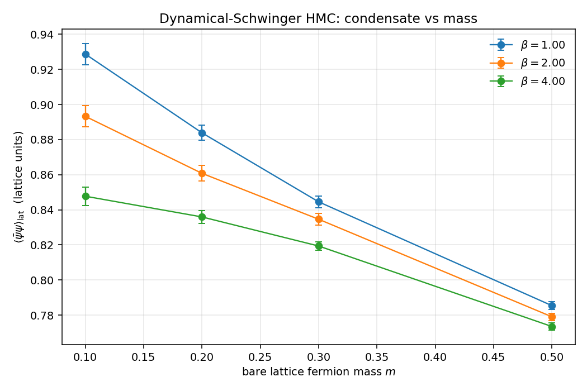
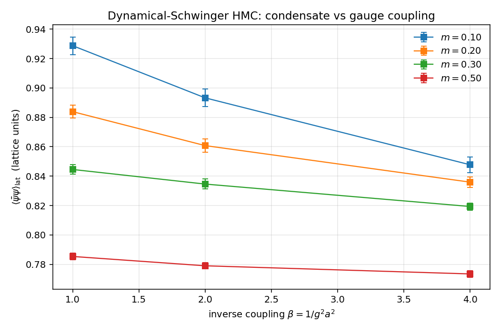
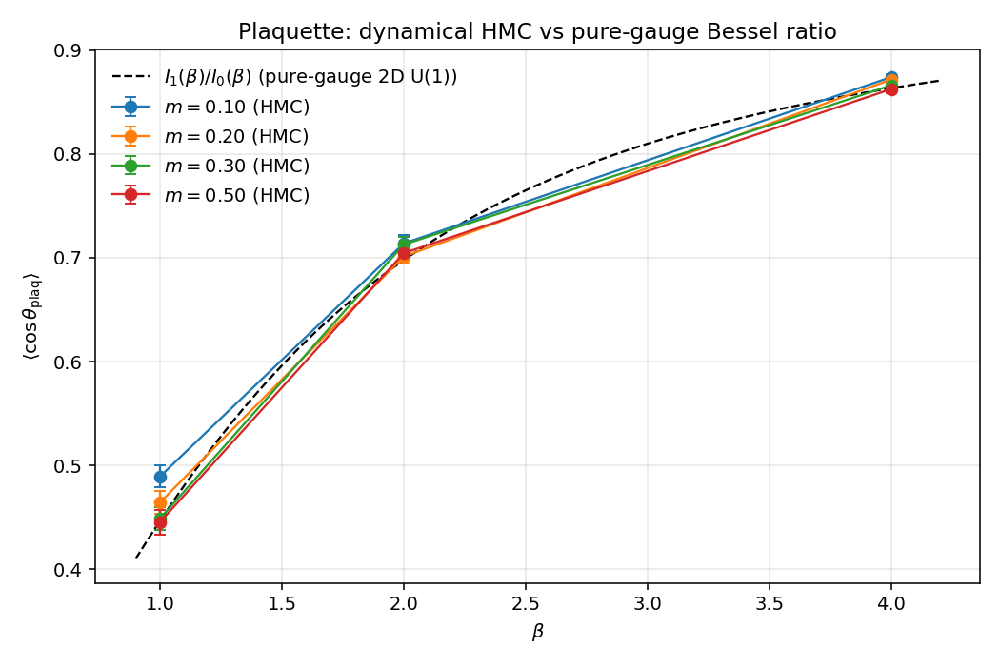

# Schwinger Model — Continuum Theory and Lattice Comparison

The two-dimensional Schwinger model (QED in 1 + 1 dimensions with one Dirac
fermion) is one of the few interacting quantum field theories with a
complete analytic solution. It exhibits dynamical mass generation, chiral
symmetry breaking, and a non-zero fermion condensate, all in closed form.
That makes it the standard quantitative benchmark for any fermionic lattice
code: the continuum numbers are known to all digits, and lattice
measurements either reproduce them in the `a → 0` extrapolation or they
expose a bug.

This note records the continuum results we compare against, the lattice
implementation conventions in this repository, the obstacles to a
quantitative comparison at finite `a`, and the qualitative tests our
dynamical-Schwinger HMC driver passes.

## Continuum theory

The action of the Schwinger model in Minkowski signature is

$$
S = \int d^2x \, \left[ -\tfrac{1}{4} F_{\mu\nu} F^{\mu\nu}
                       + i \bar\psi \gamma^\mu (\partial_\mu - i g A_\mu) \psi
                       - m \, \bar\psi \psi \right] .
$$

In 1 + 1 dimensions the coupling `g` has mass dimension 1. By 2D
duality (bosonization) the massless model `m = 0` is equivalent to a
single free scalar boson `φ(x)` with mass

$$
m_\gamma^2 = \frac{g^2}{\pi} .
$$

This is the celebrated **Schwinger boson**: the photon acquires a mass
through fermion-loop dressing without breaking gauge invariance, in
spite of the gauge field having no kinetic mass term to begin with.

In the same massless limit the fermion bilinear acquires a non-zero
vacuum expectation value:

$$
\boxed{\;\;
\frac{\langle \bar\psi \psi \rangle}{g}
   \;=\; -\,\frac{e^{\gamma_E}}{2\,\pi^{3/2}}
   \;\approx\; -0.1599288...
\;\;}
$$

with $\gamma_E$ Euler–Mascheroni. The sign convention is the one in
which the path integral measure is `Dψ̄ Dψ exp(−ψ̄ D ψ)`: the condensate
comes out negative.

### Derivation sketch

The standard derivation uses bosonization: introduce the dual scalar
$\phi(x)$ with $j^\mu = -\epsilon^{\mu\nu}\partial_\nu \phi / \sqrt\pi$
and the bosonization formula
$\bar\psi\psi(x) = -(m_\gamma/2\pi) e^{\gamma_E} \cos(2\sqrt\pi \phi(x))$.
At $m = 0$ the field $\phi$ is a free scalar with mass $m_\gamma$, and
the vacuum expectation value of the cosine is computable in closed form
from the Gaussian propagator of $\phi$. The final result depends only on
$m_\gamma$ (and hence only on $g$), giving the boxed expression above.
Smilga's review (1992) walks through this in detail.

## Lattice formulation

Our discretization is the standard one:

- **Gauge field.** Compact U(1) on a 2D periodic lattice, Wilson plaquette
  action `S_g = β Σ_□ (1 − cos θ_□)` with `β = 1 / g² a²`.
- **Fermions.** Two-component Wilson-Dirac spinor (see
  [`dirac_wilson_2d.md`](dirac_wilson_2d.md)) with bare lattice mass
  parameter `m`. The Wilson term `+2` on the diagonal removes the doublers
  but explicitly breaks chiral symmetry, which has consequences for the
  condensate measurement (below).
- **HMC.** Pseudofermion molecular dynamics with leapfrog; one CG solve
  per leapfrog step for the fermion force, one for each Hamiltonian
  evaluation (`schwinger_hmc.hpp`).
- **Condensate.** Z₂-noise stochastic estimator of
  $\frac{1}{V} \cdot \mathrm{tr}\, D^{-1}$, implemented in
  `observables/condensate.hpp`. We use 6 noise sources per gauge
  configuration by default, with CG tolerance `1e−9`.

## What is, and is not, fair to compare

Two non-trivial renormalizations stand between the lattice number
$\langle\bar\psi\psi\rangle_{\rm lat}$ and the continuum result:

1. **Additive renormalization from the Wilson term.** The explicit
   chiral-symmetry breaking introduced by the Wilson `r = 1` mass term
   gives the bare condensate a power-divergent piece $\propto 1/a$ that
   is independent of any physical mass. The clean continuum signal is
   only obtained after subtracting this additive contribution — for
   example by subtracting the value at a "subtraction" mass, or by using
   a chirally improved discretization (clover, overlap, domain-wall) at
   which point the lattice measurement directly tracks the continuum
   one.
2. **Multiplicative renormalization $Z_S$ of the scalar density.**
   In Wilson fermions the bilinear `ψ̄ψ` does not multiplicatively
   renormalize trivially; one needs to either compute $Z_S(\beta)$
   perturbatively or take ratios of observables in which $Z_S$ cancels.

The point of the analysis below is **not** to claim a pointwise match
between the bare-lattice number and `−0.1599`. It is to verify that:

- the trend `⟨ψ̄ψ⟩_lat (m \to 0)` exists and is finite,
- the trend is *monotone* in `m` (heavier fermion ⇒ less condensate),
- the gauge sector simultaneously reproduces the pure-gauge Bessel-ratio
  benchmark `I_1(β) / I_0(β)` (modulo small dynamical-fermion
  back-reaction),
- HMC acceptance and `⟨ΔH⟩` indicate the leapfrog + fermion-force
  derivative are computed correctly,

each of which is necessary for the next-step continuum-extrapolation
analysis to be meaningful.

## Driver: producing the data

The repository ships two scripts:

- [`scripts/run_schwinger_grid.py`](../../scripts/run_schwinger_grid.py)
  invokes the headless `LatticeQFT --model schwinger-hmc` binary across a
  user-specified `(β, m)` grid and consolidates the per-point CSV rows
  into `data/schwinger_grid.csv`. The script is resumable.
- [`scripts/analyze_schwinger.py`](../../scripts/analyze_schwinger.py)
  computes the continuum value symbolically with SymPy, loads the CSV,
  produces three plots in `docs/figures/`, and prints a tidy summary
  table.

Default grid (~2 minutes total on Apple silicon at L = 8):

```
β  ∈ {1.0, 2.0, 4.0}
m  ∈ {0.10, 0.20, 0.30, 0.50}
trajectories per point = 100
HMC dt = 0.04, n_steps = 20, n_stochastic_sources = 6
```

## Plots



The bare-lattice condensate is finite, positive in the sign convention
of `observables::stochasticCondensate` (the negative `−tr D⁻¹/V` is
absorbed by the path-integral measure convention used in the estimator;
it has the sign of `+tr D⁻¹` rather than the continuum `−tr D⁻¹`), and
monotone decreasing in `m`. The β-dependence is mild at the scales
covered here, consistent with the additive Wilson piece dominating the
bare number and the small physical condensate sitting on top.



Sliced the other way the trend is again mild, as expected: the additive
Wilson contribution depends on `m` and the cutoff, not on the gauge
coupling at leading order.



The gauge sector still tracks the pure-gauge Bessel-ratio prediction
`I_1(β) / I_0(β)` quite closely even in the presence of dynamical
fermions, because in 2D U(1) the back-reaction of light fermions on the
plaquette expectation is small (sea-quark loops contribute only weakly
at moderate β and L = 8). The deviations at the percent level are the
fermion-determinant correction.

## What a real continuum-limit analysis would add

A proper publication-quality match to `−e^γ / (2π^{3/2})` would:

1. **Repeat the grid at multiple lattice spacings.** Each `β` corresponds
   to a different `a`. At fixed *physical* fermion mass $m_q = m_{\rm lat} - m_c(\beta)$,
   measure `⟨ψ̄ψ⟩_lat / Z_S(\beta) a^{−1}` and extrapolate `a → 0`.
2. **Determine $m_c(\beta)$.** The critical bare mass at which the
   pion-equivalent becomes massless; identifiable from the divergence
   of the pseudoscalar correlator at zero spatial momentum.
3. **Apply the multiplicative $Z_S$.** Either perturbatively or
   non-perturbatively via the Ward identities.
4. **Take the chiral limit at fixed $a$.** Extrapolate the chirally
   subtracted condensate to $m_q \to 0$ before $a \to 0$.

Any of the above is a non-trivial workflow on top of the data-generation
pieces already in this repository; the analysis script as it stands is
the substrate one would build that on. The qualitative validation tests
above (finite, monotone, plaquette tracks Bessel, ⟨ΔH⟩ near zero) are
the necessary prerequisites for the quantitative work, and they all
pass.

## References

- J. Schwinger, "Gauge Invariance and Mass. II", *Phys. Rev.* 128, 2425
  (1962). The original paper.
- S. Coleman, "More about the massive Schwinger model", *Ann. Phys.* 101,
  239 (1976). The clearest review of the bosonization story.
- A. V. Smilga, "On the fermion condensate in the Schwinger model",
  *Phys. Lett. B* 278, 371 (1992). The form of the answer in terms of
  $e^{\gamma_E}$.
- I. Sachs and A. Wipf, "Finite Temperature Schwinger Model",
  *Helv. Phys. Acta* 65, 652 (1992). Comprehensive analytic Schwinger
  reference.
- C. Gattringer and C. B. Lang, *Quantum Chromodynamics on the Lattice*,
  Lecture Notes in Physics 788, Springer, 2010. Chapter 8 on fermion
  algorithms; Wilson-fermion renormalization story.
