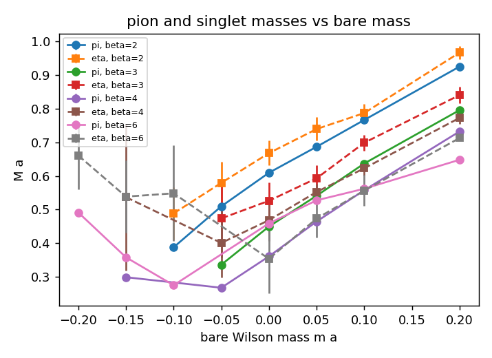

# Schwinger Model — The Mass Gap from Pseudoscalar Correlators

The massless one-flavour Schwinger model is exactly solvable: bosonization maps it onto a free
scalar of mass

    M = e / √π ≈ 0.5642 e,

the "Schwinger boson" — the photon made massive by the axial anomaly. This note describes
how the simulator measures that mass on the lattice and extrapolates it to the continuum.
It is the quantitative continuum test that [`schwinger_continuum.md`](schwinger_continuum.md)
left as future work: unlike the condensate, a mass needs no additive or multiplicative
renormalisation, so the comparison is pointwise clean once the chiral point is found.

## Correlators

Let `S = D⁻¹` be the Wilson–Dirac propagator and `P(x) = ψ̄ γ⁵ ψ`. Wick's theorem gives two
contractions for `⟨P(x) P(y)⟩`:

    C_conn(t) = (1/V) Σ_y Σ_{x : t_x − t_y ≡ t}  Σ_{a,b} |S_ab(x, y)|²
    C_disc(t) = (1/V) Σ_y Σ_{x : t_x − t_y ≡ t}  tr[γ⁵ S(x,x)] · tr[γ⁵ S(y,y)]

The connected piece is written with γ⁵-Hermiticity, `S(y, x) = γ⁵ S(x, y)† γ⁵`, which also
makes `tr[γ⁵ S(x,x)]` real. The overall sign of `⟨PP⟩` is a convention and is dropped.

- `C_conn` alone is the correlator of a flavour **non-singlet** pseudoscalar: the "pion" of a
  two-flavour theory. Its mass vanishes at the chiral point.
- `C_η = C_conn − C_disc` is the **singlet** (N_f = 1) pseudoscalar. In the Schwinger model
  this is the Schwinger boson: the disconnected "hairpin" carries the anomaly, and the mass
  stays finite as the pion goes massless.

### Why the propagator is computed exactly

On an `L × L` lattice the Wilson–Dirac operator is a `2L² × 2L²` complex matrix; at `L = 16`
that is 512 × 512 and a Gauss–Jordan inverse costs well under a second. The full inverse gives
`S(x, y)` for every source and sink at once, so (i) the translation average runs over all `V`
sources for free, and (ii) the disconnected piece, which needs `tr[γ⁵ S(x, x)]` on every
site, is exact rather than a stochastic estimate. `observables/meson_correlators.hpp`
implements this; `tests/test_mesons.cpp` checks `D·D⁻¹ = 1` to 1e-10 on a hot background,
γ⁵-Hermiticity of the inverse, and the free-field limit (below).

### Free-field check

At `U = 0` the connected correlator is a two-free-fermion state. Its threshold is twice the
Wilson pole mass, `2 ln(1 + m)`, and in two dimensions the two-particle phase space contributes
a `t^{−1/2}` prefactor, so the effective mass approaches the threshold **from above** as
`2 ln(1 + m) + O(1/t)`. On `L = 24`, `m = 0.25`: `M_eff(10) = 0.480` against `0.446`. The
disconnected piece vanishes identically at `U = 0`. These are unit tests.

## Effective masses and the chiral point

The correlators are periodic in `t`, so `C(t) ∝ cosh(M (t − L_t/2))` and the effective mass
solves `C(t)/C(t+1) = cosh(M(t − L_t/2)) / cosh(M(t + 1 − L_t/2))` (bisection). The scripts
average `M_eff` over a plateau window with inverse-variance weights.

Wilson fermions break chiral symmetry explicitly, so the chiral point is at a negative bare
mass `m_c(β)`. It is located from the pion: `M_π² ∝ (m − m_c)` near the point, so a linear fit
of `M_π²` against `m` crosses zero at `m_c`. The Schwinger boson mass is then `M_η(m_c)`,
interpolated in `m`.

## Continuum extrapolation

With the Wilson gauge action `β = 1/(e a)²`, so `e a = 1/√β` and the dimensionless
prediction is

    M_η a · √β  =  M_η / e  →  1/√π   as  a → 0.

Measuring `M_η(m_c)` at several `β` and extrapolating `M_η / e` linearly in `e a` to zero
gives the continuum value. Past the chiral point the Dirac operator is near-singular and the
HMC trajectories blow up; the grid runner records `⟨ΔH⟩` and acceptance per point and the
analysis drops points with `⟨ΔH⟩ > 0.5` or acceptance below 60%.

## Driver and analysis

    python3 scripts/run_schwinger_mass_grid.py --bin build/LatticeQFT --out data/schwinger_mass_grid.csv
    python3 scripts/analyze_schwinger_mass.py data/schwinger_mass_grid.csv

The first runs `LatticeQFT --model schwinger-hmc --corr-out` over a `(β, m)` grid (the correlator
tables with errors append to one CSV; a `_quality.csv` side file carries the HMC health); the
second prints the per-point masses, the per-`β` chiral point and `M_η / e`, the extrapolation,
and writes two figures to `docs/figures/`.

## The constant in the singlet correlator

The first grid made one thing obvious: at the weaker couplings the disconnected piece is almost
`t`-independent (at `β = 6`, `m = 0.05`: `C_disc = 0.073 → 0.066` over `t = 0 … 8` while
`C_conn` falls from 0.62 to 0.009). The reason is topology. In a fixed topological sector
`⟨ψ̄ γ⁵ ψ⟩` is not zero (the index theorem ties `Σ_x tr[γ⁵ S(x, x)]` to `Q`), so the
disconnected correlator contains `(1/V) Σ_y Σ_x ℓ_x ℓ_y` with `ℓ` the per-configuration mean of
`tr[γ⁵ S(x, x)]`: a constant `L_s ⟨ℓ²⟩ ∝ ⟨Q²⟩ / (m² V)` that does not decay in `t`. It is a
finite-volume effect that vanishes as `1/V`, but on `L = 16` near the chiral point it is the
largest term in `C_disc`.

The analysis therefore fits the singlet correlator to `A cosh(M (t − L_t/2)) + B` (the pion to
`A cosh` alone), on `t ∈ [t_min, L_t − t_min]`; the search is one-dimensional in `M` since the
model is linear in `(A, B)`. A difference correlator `C(t) − C(t+1)` removes the constant too
and is printed for comparison, but it is far noisier.

## Results — first pass (300 trajectories per point)

`L = 16`, `β ∈ {2, 3, 4, 6}`, `m ∈ {0.2, 0.1, 0.05, 0, −0.05, −0.1, −0.15, −0.2}`, 300 HMC
trajectories per point after 150 of thermalisation, one measurement every four trajectories.
Points with `⟨ΔH⟩ > 0.5` or acceptance below 60% (past the chiral point, where the Dirac
operator goes near-singular) are dropped automatically.

**The pion sector works.** `M_π` falls linearly in `M_π²` toward the chiral point and rises
again past it (Wilson fermions: `M_π² ∝ |m − m_c|`), and the chiral point on the branch
continuous with the heavy side is sharp:

| `β` | `e a` | `m_c` | `M_η(m_c) a` | `M_η / e` | exact |
|---|---|---|---|---|---|
| 2 | 0.707 | −0.162(2) | 0.40(4) | 0.57(6) | 0.564 |
| 3 | 0.577 | −0.097(2) | 0.38(5) | 0.66(8) | 0.564 |
| 4 | 0.500 | −0.063(1) | 0.38(3) | 0.76(7) | 0.564 |
| 6 | 0.408 | −0.196(4) | 0.16(9) | 0.40(22) | 0.564 |

**The singlet does not yet give a continuum number.** The singlet mass at the chiral point
carries 10–20% errors at 300 trajectories, and the `β = 6` row is not usable: `M_η a ≈ 0.23`
expected against `L = 16` gives `M L ≈ 3.7`, the topological constant dominates `C_disc`, and
the cosh-plus-constant fit is degenerate. A straight line through the four points lands at
`M_η/e → 1.0 ± 0.2`, which is 1.9σ from `1/√π` and says nothing. The trend at `β = 2, 3, 4`
(0.57, 0.66, 0.76, rising as `a` falls) is the opposite of what a clean `O(a)` approach to
0.564 would look like and is most likely the constant/cosh degeneracy on a short lattice
leaking into `M`.

What the measurement needs, in order: (i) statistics, at least ten times more at the three or
four masses closest to `m_c`; (ii) a longer time extent at `β ≥ 4` so that `M_η L_t ≳ 6` and
the constant separates from the cosh; (iii) ideally the per-configuration subtraction of
`L_s ℓ²` (or binning by topological charge) rather than a fitted constant. The dense propagator
is the limiting cost (`O((2V)³)` per configuration); `L_t = 32` at `L_s = 16` is `1024³`, a few
seconds per measurement, still feasible.

