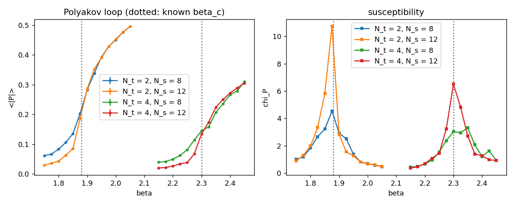
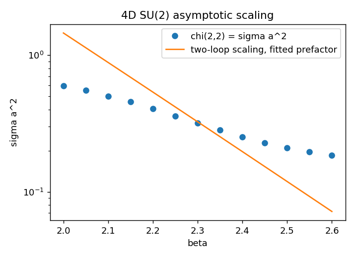

# 4D SU(2) — Finite-Temperature Deconfinement and Asymptotic Scaling

Pure SU(2) gauge theory in four dimensions confines at zero temperature and deconfines above a
critical temperature `T_c`. On the lattice, temperature is the inverse of the temporal extent,
`T = 1 / (N_t a)`, so an `N_s³ × N_t` lattice with `N_t ≪ N_s` is a thermal system and the
transition appears as a function of `β` at fixed `N_t`: `β_c(N_t)` is where `a(β_c) = 1 / (N_t T_c)`.
This note describes the Polyakov-loop measurement the simulator makes on such lattices, the
locations of `β_c` it finds, and the companion check that the string tension from the Creutz
ratio on symmetric lattices follows the two-loop renormalisation group.

## The Polyakov loop as an order parameter

The Polyakov loop at a spatial site `x` is the trace of the ordered product of temporal links
around the periodic time direction,

    P(x) = ½ tr ∏_{t=0}^{N_t−1} U_t(x, t)        (real for SU(2)),

and `⟨P⟩ = e^{−F_q / T}` is the free energy of an isolated static charge. The Wilson action is
invariant under the Z₂ centre transformation that multiplies every temporal link on one time
slice by `−1` (every plaquette has either zero or two links on that slice), while `P → −P`. In
the confined phase the symmetry is unbroken, `⟨P⟩ = 0` and `F_q = ∞`; in the deconfined phase
it breaks spontaneously and `⟨P⟩ ≠ 0`. On a finite lattice the symmetric phase tunnels between
the two sectors, so the volume average `P̄ = (1/N_s³) Σ_x P(x)` is measured through its modulus:

    ⟨|P̄|⟩,        χ_P = N_s³ (⟨P̄²⟩ − ⟨|P̄|⟩²).

The susceptibility peaks at `β_c(N_t)`, and the peak sharpens and grows with the spatial volume
(for SU(2) the transition is second order, in the 3D Ising class, so `χ_P ∝ N_s^{γ/ν}` at the
peak). `observables/polyakov.hpp` implements the loop; `tests/test_polyakov.cpp` checks that the
cold field gives `P = 1`, that the trace is cyclic along the line, that the Z₂ flip negates every
loop while leaving every plaquette unchanged, and that a hot field has `|P̄| ≪ 1`.

## Running it

`--nt N` turns the `--model su2 --dim 4` driver into an `L³ × N` lattice (the last axis is time)
and appends `polyakov_abs, polyakov_abs_err, polyakov_chi, nt` to each row of the β-scan:

    LatticeQFT --model su2 --dim 4 --L 8 --nt 2 --use-heatbath --beta-min 1.5 --beta-max 3.0 --beta-steps 16
    python3 scripts/analyze_su2_deconfinement.py su2_nt2.csv su2_nt4.csv --creutz su2_sym.csv

Without `--nt` the lattice is symmetric and the row carries the Wilson loops and Creutz ratio
only, as before.

## Asymptotic scaling of the string tension

On symmetric lattices the Creutz ratio `χ(2,2) = −ln[W(2,2) W(1,1) / (W(2,1) W(1,2))]`
estimates `σ a²`, the string tension in lattice units. If `σ` is a physical quantity the lattice
spacing must run with `β` according to the two-loop renormalisation group,

    a Λ_L = (β₀ g²)^{−β₁ / (2 β₀²)} exp(−1 / (2 β₀ g²)),      g² = 4 / β,
    β₀ = 11 N / (48 π²) = 22 / (48 π²),   β₁ = 34 N² / (3 (16 π²)²)   (N = 2),

so `ln(σ a²)` against `β` should follow that curve with a single free prefactor,
`(√σ / Λ_L)²`. The small-loop Creutz ratio overestimates `σ` (the `2×2` loop is far from the
asymptotic area law) and the match is qualitative: the slope is the test, not the prefactor.

## Results

Heat-bath scans on `N_s³ × N_t` lattices, 4000 measurement sweeps per β after 500 for
thermalisation, in steps of `Δβ = 0.025` around each transition (`data/su2_4d_nt*_fine_L*.csv`;
the coarse `Δβ = 0.1` scans over `1.5 ≤ β ≤ 3.0` are `data/su2_4d_nt{2,4}.csv`).

| `N_t` | `N_s` | peak of `χ_P` at `β` | `χ_P` at peak | published `β_c` |
|---|---|---|---|---|
| 2 | 8  | 1.875 | 4.5  | 1.88 |
| 2 | 12 | 1.875 | 10.7 | 1.88 |
| 4 | 8  | 2.35 (flat 2.30–2.35) | 3.3 | 2.30 |
| 4 | 12 | 2.300 | 6.5  | 2.30 |

- Both transitions land on the published couplings to the `0.025` resolution of the scan.
- The peak grows with volume as a second-order transition requires: by `2.4×` at `N_t = 2`
  and `2.0×` at `N_t = 4` for `N_s = 8 → 12`, against `(12/8)^{γ/ν} = 2.2` for the 3D
  Ising class (`γ/ν ≈ 1.96`). The `N_s = 8`, `N_t = 4` peak is broad enough to straddle two
  points; at `N_s = 12` it is unambiguous.
- `⟨|P̄|⟩` below the transition drops with volume (the `1/√V` tunnelling remnant of the
  symmetric phase) while above it the two volumes coincide: the ordered phase has a
  genuine expectation value.

**Scaling between the two `N_t`.** With the two-loop `a(β) Λ_L`, `T_c / Λ_L = 1 / (N_t a(β_c) Λ_L)`
comes out as 29.4 at `N_t = 2` and 42.3 at `N_t = 4`. Asymptotic scaling would make these
equal; the 40% mismatch is the well-known scaling violation at `N_t = 2` (`a` is too coarse
for two-loop running at `β ≈ 1.9`), and the numbers agree with the standard values quoted for
these two lattices (about 30 and about 42).

**Creutz ratio on symmetric lattices** (`data/su2_4d_sym_L8.csv`, `8⁴`, `2.0 ≤ β ≤ 2.6`):
`χ(2,2)` falls from 0.60 to 0.19, with `d ln(σa²)/dβ = −2.1` against the two-loop
`−5.0`. The `2×2` Creutz ratio therefore does **not** follow asymptotic scaling at these
couplings: it still sits on the strong-to-weak crossover, and the small loop is dominated by
the perturbative Coulomb piece rather than the area law. Forcing the two-loop curve through
the points gives `√σ / Λ_L ≈ 96`, the magnitude Creutz obtained from the same small-loop
ratios, but the slope says that number is not an asymptotic-scaling determination. Larger loops
on larger lattices (multilevel Wilson loops are in the tree for exactly this) are the honest
route to the string tension.

