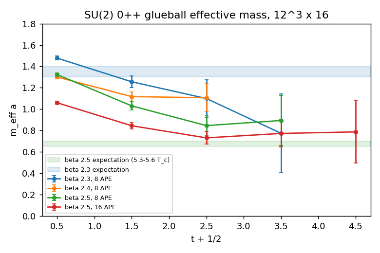

# 4D SU(2) — The Scalar Glueball from Smeared Plaquette Correlators

Pure gauge theory has a mass gap: its lightest excitation is the scalar glueball, `J^PC = 0⁺⁺`.
On the lattice its mass is read off the exponential decay of the correlator of a
zero-momentum, cubic-group-A₁⁺⁺ operator between time slices. This note records the operator,
the smearing that makes the measurement possible, and the numbers.

## Operator and correlator

The simplest operator with vacuum quantum numbers on a time slice `τ` is the sum of all
spatial plaquettes on the slice,

    O(τ) = Σ_{x ∈ slice τ} Σ_{i<j spatial} ½ Re tr U_ij(x),

and the vacuum-subtracted correlator is

    C(t) = (1/N_t) Σ_τ ⟨O(τ) O(τ + t)⟩ − ⟨O⟩²  =  Σ_n |⟨0|O|n⟩|² (e^{−m_n t} + e^{−m_n (N_t − t)}).

The effective mass from the periodic cosh form plateaus at the lightest `0⁺⁺` state. Two
things make this hard:

- **Overlap.** A single thin plaquette is a tiny object; the glueball is of order 1 fm across.
  The operator is therefore built from APE-smeared **spatial** links (`smearing/ape.hpp`,
  `n` steps of `U → Π[U + α Σ staples]` with the temporal links untouched so the transfer
  matrix is unchanged). Smearing fattens the operator to the glueball's size and raises the
  overlap on the ground state by orders of magnitude.
- **Noise.** `C(t)` is a difference of two large numbers, and the statistical error of a
  glueball correlator is roughly constant in `t` while the signal falls as `e^{−mt}`: with
  `m a ≈ 0.7–1` there are three or four usable time slices. The driver keeps the per-sample
  `O(τ)` data and uses a blocked jackknife for the errors on `C(t)` and on `m_eff(t)`.

`observables/glueball.hpp` implements the slice operator, the per-configuration slice products
and the connected correlator; `tests/test_glueball.cpp` checks the cold-field value
`O = 3 N_s³` with vanishing connected correlator, agreement of the slice sum with a direct
plaquette loop, periodicity of the slice products, uncorrelated slices on a hot field, and
that spatial smearing leaves temporal links bit-identical.

## Running it

    LatticeQFT --model su2 --dim 4 --L 12 --nt 16 --use-heatbath --beta-min 2.4 --beta-max 2.4 --beta-steps 1 \
        --therm 500 --measure-sweeps 20000 --sample-every 4 --smear-n 8 --smear-alpha 0.5 --glueball-out glue.csv

writes `beta, L, nt, smear_n, smear_alpha, t, C, C_err, meff, meff_err, n_samples`.

## What to compare with

The glueball mass is a physical quantity, so its ratio to another physical scale must be
independent of `β` once scaling sets in. The cleanest scale this project measures itself is
the deconfinement temperature: `β_c(N_t)` from [`su2_deconfinement.md`](su2_deconfinement.md)
gives `T_c a(β_c) = 1/N_t`, so at `β = 2.30` (`N_t = 4`) `m a = (m/T_c)/4`, and at
`β ≈ 2.50` (where `β_c(N_t = 8) ≈ 2.51`) `m a ≈ (m/T_c)/8`. Published large-volume values
for SU(2) put `m_{0⁺⁺}/√σ ≈ 3.7–3.9` and `T_c/√σ ≈ 0.69–0.71`, hence `m_{0⁺⁺}/T_c ≈ 5.3–5.6`:
`m a ≈ 1.3–1.4` at `β = 2.30` and `≈ 0.65–0.70` at `β = 2.50`.

## Results

`12³ × 16`, heat-bath, 20 000 sweeps after 500 of thermalisation, one measurement every
four sweeps (5000 samples), blocked jackknife with 500 blocks of 10 samples. About half an hour per run on a laptop.

| `β` | APE steps | `m_eff(1)` | `m_eff(2)` | `m_eff(3)` | expected `m a` (from `m/T_c ≈ 5.3–5.6`) |
|---|---|---|---|---|---|
| 2.3 | 8  | 1.26(6) | 1.10(18) | 0.8(4) | 1.3–1.4 |
| 2.4 | 8  | 1.12(5) | 1.11(13) | — | ≈ 1.0 |
| 2.5 | 8  | 1.03(4) | 0.85(9)  | 0.89(24) | 0.65–0.70 |
| 2.5 | 16 | 0.85(3) | 0.73(6)  | 0.77(13) | 0.65–0.70 |

- **Smearing is the whole game.** At `β = 2.5` doubling the APE steps lowers `m_eff(1)` from
  1.03(4) to 0.85(3) and `m_eff(2)` from 0.85(9) to 0.73(6): the thinner operator still has
  a large excited-state admixture at `t = 1`, and the fatter one reaches a plateau
  `m a ≈ 0.75(6)` for `t ≥ 2`, consistent with the expected 0.65–0.70 at the one-sigma level
  with a residual excited-state bias in the right direction. A variational basis over several
  smearing levels (the standard next step) would remove that bias.
- **The mass drops with `β` as it must.** `m_eff(2)` goes 1.10(18) → 1.11(13) → 0.85(9) /
  0.73(6) from `β = 2.3` to 2.5, tracking the lattice spacing, and the `β = 2.3` value sits
  where `m/T_c` with our own `β_c(N_t = 4) = 2.30` puts it.
- **Signal length.** The correlator is lost in the noise beyond `t = 3–4` at all three
  couplings (the error on `C(t)` is flat at ≈ 0.04–0.3 while the signal falls by `e^{−m}` per
  slice), which is the known limitation of a single thin-to-medium operator at 5000 samples.

The `β = 2.5`, 16-step point is the result: `m_{0⁺⁺} a = 0.75(6)` against 0.65–0.70 expected,
i.e. `m_{0⁺⁺}/T_c ≈ 6.0(5)` with `T_c a = 1/8` at this coupling (`β_c(N_t = 8) ≈ 2.51` from the
literature; this project's own scans stop at `N_t = 4`).
