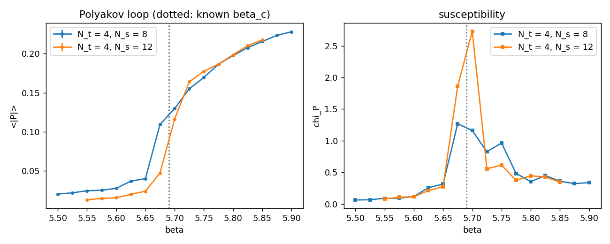

# 4D SU(3) — Cabibbo–Marinari Heat-Bath, Plaquette Benchmarks, Deconfinement

SU(3) pure gauge theory is the gluonic sector of QCD. The simulator carries the group as
3×3 complex matrices (`math/su3.hpp`), the Wilson action `S = β Σ_□ (1 − ⅓ Re tr U_□)` with
`β = 6/g²` (`models/su3.hpp`), and two local updates: a single-link Metropolis whose proposal
is a near-identity SU(2) rotation in one of the three Cabibbo–Marinari subgroups, and the
heat-bath described here. This note records the heat-bath construction and the benchmarks
that pin the implementation to published numbers.

## Cabibbo–Marinari heat-bath

There is no closed-form heat-bath for SU(3), but Cabibbo and Marinari (Phys. Lett. B 119,
387, 1982) showed that updating a link through a sequence of SU(2) subgroups is enough: each
subgroup step is an exact heat-bath within that subgroup, the three subgroups on the row/column
pairs `(0,1), (0,2), (1,2)` generate SU(3), and the composition leaves the Wilson measure
invariant.

The single-link weight at fixed staple sum `A` is `exp((β/3) Re tr(U A))`. Write the update as
`U → α U` with `α` an SU(2) element embedded in rows and columns `(i, j)`, and let `W = U A`.
Then

    Re tr(α U A) = Re tr(α₂ W₍ᵢⱼ₎) + (terms independent of α),

with `W₍ᵢⱼ₎` the 2×2 block of `W`. A 2×2 complex matrix splits into a part proportional to an
SU(2) element, `[[a, b], [−b̄, ā]]`, and a part whose trace against every SU(2) element is
purely imaginary. Only the quaternion projection

    a = ½ (W_ii + W̄_jj),   b = ½ (W_ij − W̄_ji),   k = √(|a|² + |b|²),   V = [[a, b], [−b̄, ā]] / k

survives, so the conditional for `α` is the SU(2) heat-bath weight

    exp((β/3) k Re tr(α V)) = exp((2β/3) k · w₀(α V)),

the Kennedy–Pendleton problem of [`su2_lattice.md`](su2_lattice.md) with `a = (2β/3) k`. The
code samples `X = (w₀, √(1 − w₀²) n̂)`, sets `α = X V†`, embeds, multiplies, visits the three
subgroups in turn with `W` recomputed after each, and re-projects the link to SU(3) at the end
against round-off drift (`monte_carlo/su3_heatbath.hpp`).

`tests/test_su3_heatbath.cpp` checks that the quaternion projection inverts the embedding
exactly, that links stay unitary with unit determinant over many sweeps, the strong-coupling
plaquette `⟨P⟩ ≈ β/18`, the cold limit at large `β`, agreement with the Metropolis chain at
`β = 5.0`, and that the SU(3) Polyakov loop is 1 on the cold field and picks up `e^{2πi/3}`
under a Z₃ centre rotation that leaves every plaquette unchanged.

### A note on the agreement test

The heat-bath/Metropolis comparison was first tried at `β = 5.5` on `4⁴` and disagreed at the
percent level with the Metropolis value drifting with the step size. That is not a bias: a `4⁴`
lattice is a finite-temperature system with `N_t = 4`, and `β = 5.5` sits just below its
first-order deconfinement transition (`β_c ≈ 5.69`), where both chains show autocorrelations
of thousands of sweeps and single-configuration plaquettes scatter over 0.47–0.51. At
`β = 5.0` cold and hot starts of both algorithms agree to `5·10⁻⁴`.

## Plaquette benchmarks

`LatticeQFT --model su3 --dim 4 --L 8 --use-heatbath --beta-min 5.0 --beta-max 6.6 --beta-steps 17 --therm 300 --measure-sweeps 1000 --sample-every 2`
(about 20 ms per sweep on `8⁴`):

| `β` | `⟨P⟩` (this code, `8⁴`) | published (large volume) |
|---|---|---|
| 5.5 | 0.4958(1) | ≈ 0.50 |
| 5.7 | 0.5496(1) | 0.549 |
| 6.0 | 0.5943(1) | 0.594 |
| 6.2 | 0.6139(1) | 0.614 |
| 6.4 | 0.6309(1) | 0.631 |

The three-digit agreement at `β ≥ 5.7` is the strongest single check of the SU(3) action,
staples and update in the tree. At `β = 5.5` the `8⁴` lattice is itself near the `N_t = 8`
transition and finite-volume effects are visible at the third digit.

## Deconfinement at N_t = 4

As for SU(2) ([`su2_deconfinement.md`](su2_deconfinement.md)), `--nt 4` makes the lattice
`N_s³ × 4` and appends `⟨|P̄|⟩`, `χ_P = N_s³ (⟨|P̄|²⟩ − ⟨|P̄|⟩²)` and the extents to the scan.
For SU(3) the loop is complex and the centre is Z₃; the transition is **first order**, so
`⟨|P̄|⟩` jumps rather than rising smoothly and `χ_P` at the peak grows like the volume.

    LatticeQFT --model su3 --dim 4 --L {8,12} --nt 4 --use-heatbath --beta-min 5.5 --beta-max 5.9 --beta-steps 17 --therm 500 --measure-sweeps 3000 --sample-every 2

| `N_s` | peak of `χ_P` at `β` | `⟨|P̄|⟩` across the peak | published `β_c(N_t = 4)` |
|---|---|---|---|
| 8  | 5.675 | 0.040 → 0.110 between 5.650 and 5.675 | 5.69 |
| 12 | 5.700 | 0.047 → 0.116 between 5.675 and 5.700 | 5.69 |

Both volumes put the jump in `⟨|P̄|⟩` between `β = 5.675` and `5.700`, bracketing the published
`5.6925`; the susceptibility peak moves from 5.675 (`N_s = 8`, 1.27) to 5.700 (`N_s = 12`, 2.73),
and the two-point jump in `⟨|P̄|⟩` is what a first-order transition on a finite lattice looks
like, in contrast with the smooth SU(2) rise. Below the transition `⟨|P̄|⟩` falls with volume
as `1/√V` (0.020 → 0.013 at `β = 5.55`), above it the two volumes agree, as for SU(2).

With the two-loop SU(3) scale, `β_c ≈ 5.69` at `N_t = 4` corresponds to `T_c / Λ_L ≈ 75`.
The comparison between different `N_t` (the asymptotic-scaling test done for SU(2)) needs
`N_t = 6` at `β_c ≈ 5.89` on at least `16³ × 6`, which is the next step.
